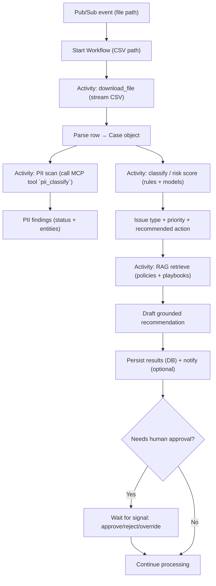

# Scenario: Processing a Support/Fraud CSV Row

This document walks through what the app does for one CSV row, end-to-end, in plain English.

## Input Row (Example)

Row 1 from `data/support.csv`:

```
C-10001,U-9001,2026-05-19T09:12:00Z,email,jane.doe@example.com,"Chargeback on unknown merchant","I see a $129.99 charge from 'NORTHTRAVEL*ONLINE' on 2026-05-18. I did not authorize this transaction. Please reverse it and block my card.",fraud
```

## What the App Does (Plain English)

1) **Workflow starts**
- A Pub/Sub event (or a local test event) points to the CSV file path, e.g. `data/support.csv`.
- The system starts the workflow with that file path as input.

2) **Download/stream the file**
- The `download_file` activity opens the CSV as a stream.
- The workflow reads the file line-by-line so it never loads the whole file into memory.

3) **Parse a row into a “case” object**
- The first row is parsed into a structured object:
  - `case_id = C-10001`
  - `user_id = U-9001`
  - `email = jane.doe@example.com`
  - `subject = "Chargeback on unknown merchant"`
  - `description = "I see a $129.99 charge ... block my card."`
  - `category = fraud` (optional; can be treated as a label or ignored for “predicted” classification)

4) **PII check (MCP tool)**
- The app sends selected fields (or a masked version) to the MCP tool `pii_classify`.
- The tool returns a structured result like:
  - `status = Sensitive`
  - `entities = [...]` (email, phone, etc., if detected)
- The app records “PII present” and decides:
  - whether to mask/redact fields before storing/searching
  - whether the case requires stricter handling

5) **Classification / risk scoring**
- The app runs one or more “checkers” (rules and/or AI models) to classify the issue and determine urgency.
- For this row, the likely result is something like:
  - `issue_type = unauthorized_charge`
  - `priority = high`
  - `recommended_action = start_chargeback_flow + advise_card_block`

6) **RAG step (ground the recommendation in policy)**
- The app retrieves relevant internal policy/runbook snippets, such as:
  - “Chargeback handling policy”
  - “Unauthorized card transaction playbook”
  - “Identity verification requirements”
- The app drafts a recommended action plan/response using those retrieved documents as grounding, not “from memory”.

7) **Persist outputs**
- The app stores structured results (case + PII findings + classification + retrieved doc IDs + recommendation) in Postgres (or another store).
- Optionally it notifies downstream systems (Slack, ticketing, webhook) with a summary.

8) **Human-in-the-loop (optional via signals)**
- If the decision is “needs review”, the workflow pauses and waits for an operator signal:
  - `approve_action`
  - `reject_action`
  - `override_policy`
- On signal, the workflow resumes and continues.

9) **Continue processing remaining rows**
- The workflow continues streaming subsequent CSV rows.
- Processing can run in parallel with a configurable concurrency limit.

## Diagram (High Level)


